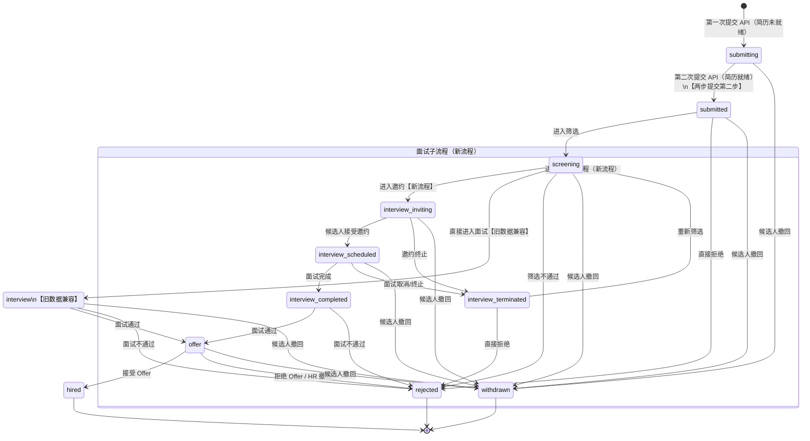

# XMAX 职位申请状态机说明文档

## 概述

XMAX 求职申请系统采用有限状态机（FSM）管理每条申请记录的生命周期。状态定义及合法流转规则集中维护在 `application_status.js` 的 `statusFlow` 对象中。

- **状态总数**：12 个
- **初始状态**：`submitting`（由第一次提交 API 调用创建）
- **终态（3 个）**：`hired`、`rejected`、`withdrawn`（进入后不再流转）
- **两步提交流程**：候选人首次提交时，系统先创建 `submitting` 状态记录；当简历就绪后，系统以相同的 `jobId + candidateId` 发起第二次调用，状态自动推进至 `submitted`
- **兼容旧数据**：`interview` 状态为历史遗留，新流程不再直接进入该状态，由 `screening` 经由 `interview_inviting` 展开面试子流程

---

## 状态说明

| # | 状态名 | 中文描述 | 类型 |
|---|--------|----------|------|
| 1 | `submitting` | 申请中 | 初始状态 |
| 2 | `submitted` | 已提交 | 中间状态 |
| 3 | `screening` | 筛选中 / 待邀请 | 中间状态 |
| 4 | `interview` | 面试阶段（兼容旧数据） | 中间状态（遗留） |
| 5 | `interview_inviting` | 邀约中 | 面试子状态 |
| 6 | `interview_scheduled` | 待面试 | 面试子状态 |
| 7 | `interview_completed` | 已面试 | 面试子状态 |
| 8 | `interview_terminated` | 面试已终止 | 面试子状态 |
| 9 | `offer` | Offer 阶段 | 中间状态 |
| 10 | `hired` | 已录用 | 终态 |
| 11 | `rejected` | 已拒绝 | 终态 |
| 12 | `withdrawn` | 已撤回 | 终态 |

---

## 状态转换图（Mermaid）



> **渲染说明**：在 GitLab / GitHub Markdown、Obsidian、VS Code Mermaid 插件等支持 Mermaid 的环境中可直接预览上图。

---

## 状态流转表（文本补充）

下表列出每个状态的所有合法后继状态，与 `application_status.js` 中的 `statusFlow` 对象一一对应。

| 当前状态 | 可流转至的下一状态 | 备注 |
|----------|--------------------|------|
| `submitting` | `submitted`、`withdrawn` | 初始状态；`submitted` 为两步提交第二步触发 |
| `submitted` | `screening`、`rejected`、`withdrawn` | |
| `screening` | `interview`、`interview_inviting`、`rejected`、`withdrawn` | `interview` 仅用于旧数据兼容 |
| `interview` | `offer`、`rejected`、`withdrawn` | 遗留状态，新流程不再使用 |
| `interview_inviting` | `interview_scheduled`、`interview_terminated`、`withdrawn` | 新流程面试邀约阶段 |
| `interview_scheduled` | `interview_completed`、`interview_terminated`、`withdrawn` | 等待面试进行 |
| `interview_completed` | `offer`、`rejected` | 面试结束，无法撤回 |
| `interview_terminated` | `screening`、`rejected` | 可重新进入筛选 |
| `offer` | `hired`、`rejected`、`withdrawn` | |
| `hired` | —（终态） | 流程结束 |
| `rejected` | —（终态） | 流程结束 |
| `withdrawn` | —（终态） | 流程结束 |

---

## 关键流程路径示例

### 正常录用路径（新流程）

```
submitting → submitted → screening → interview_inviting
→ interview_scheduled → interview_completed → offer → hired
```

### 候选人中途撤回

```
submitting → submitted → screening → interview_inviting → withdrawn
```

### 面试邀约终止后重新筛选

```
screening → interview_inviting → interview_terminated → screening → ...
```

### 旧数据兼容路径

```
screening → interview → offer → hired
```

---

*本文档依据 `application_status.js` 中的 `statusFlow` 定义生成，如状态机规则变更请同步更新本图。*
